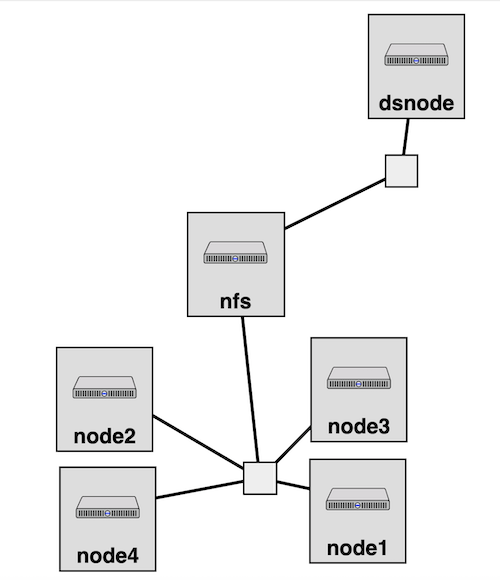

# CloudLab-EVA-NFS-Profile

A [ClouldLab](https://cloudlab.us/) experiment profile, forked from [nfs-dataset](https://github.com/lbstoller/nfs-dataset), that is used to set up an n-node cluster of machines along with an NFS server. The NFS server uses a long term dataset that is persistent across experiments and is mounted at `/nfs` across all nodes. The profile also mounts a temporary block storage  at `/nfs` across all nodes. Note that the temporary storage is removed when the experiment ends.

## To Create the Profile
1) Go to Create Profile: `Experiments -> Create Experiement Profile`
2) Select `Git Repo` to create a repository based Profile.
3) Paste the Repo URL and confirm.

## Topology Preview

  

